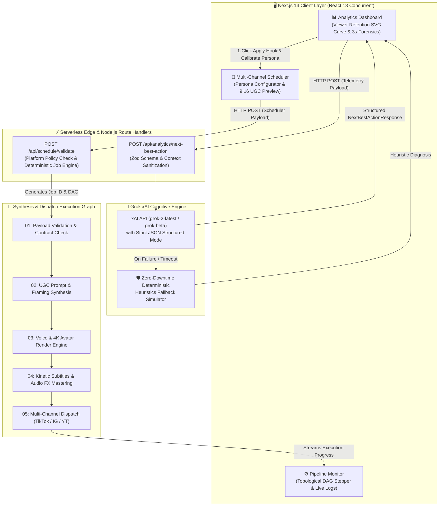
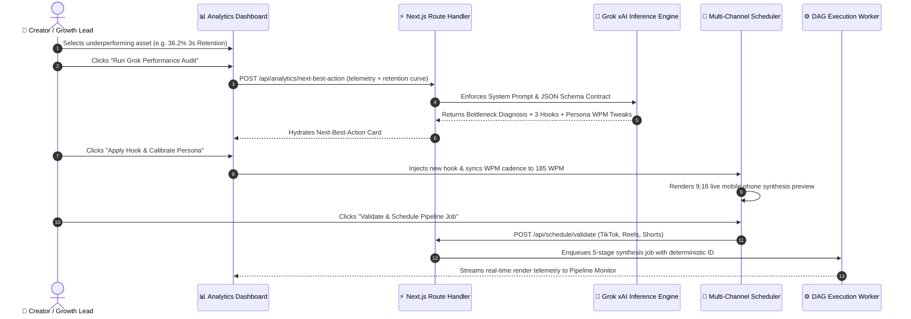
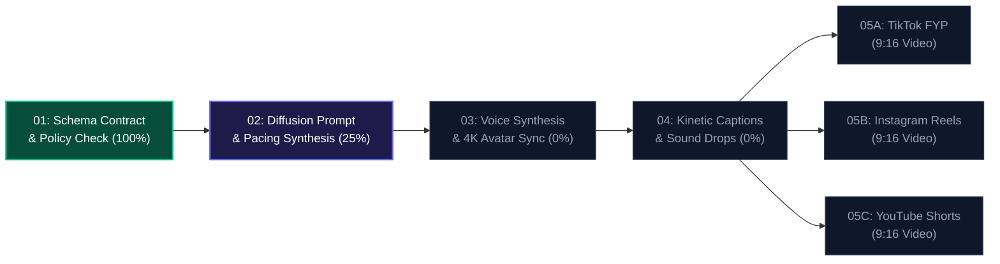

<div align="center">

# ⚡ Osynth Growth Engine

### *Autonomous AI-Native Creator Growth & Next-Best-Action Operations Hub*

[](https://growthengine-three.vercel.app)
[](https://nextjs.org/)
[](https://www.typescriptlang.org/)
[](https://tailwindcss.com/)
[](https://x.ai/)
[](LICENSE)

<p align="center">
  <b>Osynth Growth Engine</b> connects short-form UGC synthesis to cross-platform publishing and an automated, cognitive <b>"Performance to Next-Best-Action"</b> recommendation engine powered by <b>xAI Grok-2</b>.
</p>

[✨ Live Production Demo](https://growthengine-three.vercel.app) • [🚀 Deploy on Vercel](#-deployment-to-vercel) • [🛡️ Engineering Defense Doc](./OSYNTH_ENGINEERING_DEFENSE.md) • [📊 Architecture](#-architecture-overview)

---

</div>

## 🌟 Core Feature Matrix

### 1. 📈 Analytics to "Next-Best-Action" Recommendation Engine
- **Viewer Retention Forensics:** Interactive SVG viewer retention curve ($0.0\text{s} - 20.0\text{s}$) plotted against the **60% Viral FYP Threshold**.
- **Drop-off Root Cause Diagnosis:** Grok analyzes drop-off spikes (e.g. at second 2.8) and isolates cognitive friction points.
- **3 High-Converting Hook Variants:** Generates tailored *Curiosity Gap*, *Contrarian Hot-Take*, and *Problem Agitation* hooks with visual camera cue descriptions and expected retention boosts ($+20\text{--}40\%$).
- **Persona Calibrations:** Prescribes exact verbal cadence tweaks (WPM), vocal tone shifts, energy modulation, and camera framing upgrades with 1-click apply.

### 2. 📅 Multi-Channel Content Scheduler & UGC Engine
- **AI Persona Studio:** Calibrate delivery speed from 100 to 240 WPM, configure energy states (*Subtle*, *Conversational*, *High Energy*, *Electrifying*), and adjust framing styles.
- **Cross-Platform Matrix:** Simultaneous publishing orchestration across **TikTok FYP**, **Instagram Reels**, and **YouTube Shorts** with platform constraint validation (9:16 aspect ratios, character limits, hashtag caps).
- **9:16 Live UGC Phone Mockup:** Real-time simulated phone viewport rendering kinetic subtitle overlays, vocal frequency audio waves, persona badges, and channel watermarks.
- **Dynamic Hashtags & CTA Engine:** Real-time tag injection and engagement trigger builder.

### 3. ⚙️ Topological Pipeline Monitor
- **5-Stage Synthesis DAG:** Tracks *Payload Validation* $\rightarrow$ *UGC Prompt Synthesis* $\rightarrow$ *Voice/Avatar Engine* $\rightarrow$ *Dynamic Kinetic Subtitles* $\rightarrow$ *Multi-Channel Staging*.
- **Real-Time Terminal Execution Stream:** Live streaming logs showing timestamped worker events, phoneme alignment progress, and bitrate encoding.

---

## 🏗️ Architecture Overview

### End-to-End System Architecture



---

### Closed-Loop Creator Operations Workflow



---

### 5-Stage Synthesis DAG Execution Flow



---

## ⚡ Serverless API Contracts

### `POST /api/analytics/next-best-action`
Executes deep LLM reasoning over post telemetry and returns structured prescription metrics.

#### Request Payload:
```json
{
  "postId": "post_ugc_01",
  "title": "Why 99% of LLM wrappers will die in 6 months",
  "platform": "tiktok",
  "views": 48920,
  "watchTimeSeconds": 11.4,
  "retention3s": 36.2,
  "ctr": 2.1,
  "engagementRate": 4.8,
  "currentHook": "Hey guys, today I want to talk about why most AI startups are making a mistake...",
  "currentHookType": "statement",
  "personaSettings": {
    "name": "Alex V - The AI Maverick",
    "pacingWpm": 145,
    "tone": "Explanatory, casual introduction",
    "energyLevel": "conversational",
    "framing": "Medium shot with static background"
  }
}
```

#### Response:
```json
{
  "status_summary": "Critical front-loaded drop-off detected: Only 36.2% of viewers stayed past 3s...",
  "key_bottleneck": "Opening hook takes 2.8s to establish tension, causing high swipe-away.",
  "severity": "critical",
  "next_best_action": "Deploy a High-Velocity Contrarian Hook with an immediate visual disruption at 0.0s...",
  "improved_hooks": [
    {
      "id": "hook_1",
      "type": "contrarian_take",
      "headline": "The Unpopular Truth Disruptor",
      "openingScript": "Everyone is telling you to optimize your captions, but they're completely wrong...",
      "expectedRetentionBoost": "+32% 3s Retention",
      "visualCue": "Direct eye contact with aggressive camera zoom and bold red underline."
    }
  ],
  "persona_parameter_adjustments": {
    "pacingWpm": { "current": 145, "recommended": 185, "reasoning": "Eliminates dead air..." },
    "tone": { "current": "Explanatory", "recommended": "Urgent and authoritative", "reasoning": "..." },
    "energyLevel": { "current": "conversational", "recommended": "electrifying", "reasoning": "..." },
    "framing": { "current": "Medium shot", "recommended": "Tight dynamic crop with kinetic zooms", "reasoning": "..." }
  },
  "model_used": "Grok (grok-2-latest)",
  "generated_at": "2026-08-18T13:25:00.000Z"
}
```

---

### `POST /api/schedule/validate`
Validates multi-channel schema contracts and initializes deterministic pipeline DAG execution.

#### Request Payload:
```json
{
  "contentTitle": "3 AI Agents That Run an Entire E-Com Store",
  "openingHook": "Stop hiring $3,000/mo agencies: these three open-source agents do the same work in 4 minutes.",
  "scriptContent": "Scene 1: Architecture loop...",
  "personaId": "persona_alex_tech",
  "personaSettings": {
    "name": "Alex V - The AI Maverick",
    "tone": "Fast, authoritative",
    "pacingWpm": 185,
    "energyLevel": "high_energy",
    "framing": "Tight dynamic crop"
  },
  "targetPlatforms": [
    { "channel": "tiktok", "enabled": true, "aspectRatio": "9:16", "autoHashtags": true, "privacy": "public" },
    { "channel": "instagram", "enabled": true, "aspectRatio": "9:16", "autoHashtags": true, "privacy": "public" },
    { "channel": "youtube", "enabled": true, "aspectRatio": "9:16", "autoHashtags": true, "privacy": "public" }
  ],
  "scheduledTimestamp": "2026-08-18T18:00:00.000Z",
  "tags": ["ai", "automation", "growth"],
  "callToAction": "Comment 'AGENT' for the full repo"
}
```

---

## 🚀 Getting Started

### 1. Clone the Repository
```bash
git clone https://github.com/PTP063/growth_eng.git
cd growth_eng
```

### 2. Install Dependencies
```bash
npm install
```

### 3. Configure Environment (Optional)
Copy `.env.example` to `.env.local`:
```bash
cp .env.example .env.local
```

Configure your environment variables:
```env
# Optional: Add live xAI Grok API key from https://console.x.ai
# If left blank, the app runs flawlessly using the built-in deterministic AI simulator
XAI_API_KEY=your_xai_api_key_here
GROK_MODEL=grok-2-latest
```

### 4. Run Development Server
```bash
npm run dev
```
Open **[http://localhost:3000](http://localhost:3000)** in your browser.

---

## 🚢 Deployment to Vercel

Deploy instantly to Vercel with zero configuration:

[](https://vercel.com/new/clone?repository-url=https%3A%2F%2Fgithub.com%2FPTP063%2Fgrowth_eng)

### Manual Deployment:
1. Go to **[vercel.com/new](https://vercel.com/new)**.
2. Select and import **`PTP063/growth_eng`**.
3. Add `XAI_API_KEY` under **Environment Variables** *(optional)*.
4. Click **Deploy**.

---

## 🛡️ Engineering Defense Document

Before pitching to founders or tech leads, review the exhaustive 4-part defense guide:  
👉 **[`OSYNTH_ENGINEERING_DEFENSE.md`](./OSYNTH_ENGINEERING_DEFENSE.md)**

It covers:
- **End-to-End Architectural Deep-Dive:** Schema contracts, edge handlers, and atomic state.
- **Edge Cases & Hardening:** LLM JSON repair, Redis Redlock idempotency, and OAuth2 token refresh queues.
- **Scale & Latency:** SSE streaming, optimistic UI rollbacks, and Kahn's algorithm for DAG cycle prevention.
- **15 Grilling Interview Questions & Senior Model Answers.**

---

## 🛠️ Technology Stack

| Domain | Technology | Purpose |
| :--- | :--- | :--- |
| **Framework** | [Next.js 14](https://nextjs.org/) (App Router) | High-performance React framework with serverless edge handlers |
| **Language** | [TypeScript 5](https://www.typescriptlang.org/) | Strict end-to-end type safety |
| **Styling** | [Tailwind CSS 3](https://tailwindcss.com/) | Design system inspired by [thegrowthengine.net](https://thegrowthengine.net/) |
| **AI Reasoning** | [xAI Grok-2](https://x.ai/) | LLM performance diagnosis & high-converting hook generation |
| **Validation** | [Zod](https://zod.dev/) | Edge runtime contract enforcement |
| **Diagrams** | [Mermaid.js](https://mermaid.js.org/) | Visual system architecture & sequence graphs |
| **Icons** | [Lucide React](https://lucide.dev/) | Modern, lightweight UI iconography |
| **Hosting** | [Vercel](https://vercel.com/) | Edge deployment with automatic CI/CD |

---

<div align="center">

Made with ⚡ by the **Osynth Engineering Team**

</div>
